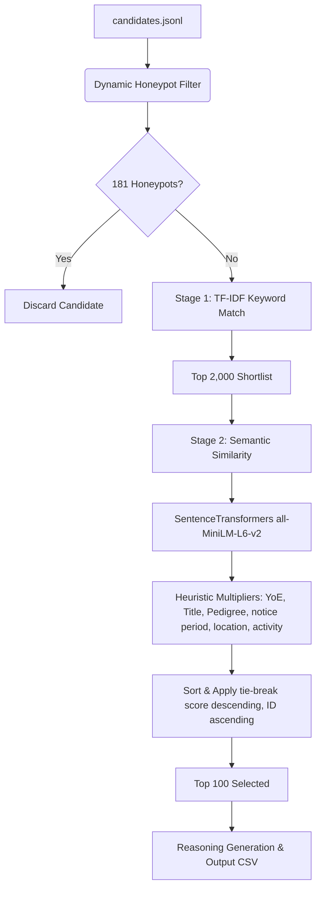

# Redrob Hackathon Intelligent Candidate discovery & ranking system

This repository contains the candidate ranking engine for the Senior/Principal Machine Learning Engineer (applied NLP/IR) role.

Our solution leverages a two-stage information retrieval pipeline to scale to 100,000 candidates on CPU within the 5-minute wall-clock time limit.

## System Architecture



1. **Dynamic Honeypot Filter**: Before ranking, we dynamically check candidates for logical contradictions (e.g. reported job duration exceeding total years of experience, range violations in signals, or expert skills with 0 months used).
2. **Stage 1 (TF-IDF Retrieval)**: We represent each candidate's profile (current title, headline, summary, skills, past job titles, and job descriptions) as a document. We calculate cosine similarity against a keyword query constructed from the Job Description. The top 2,000 candidates are retained. This step takes `< 3 seconds` on CPU.
3. **Stage 2 (Semantic Re-ranking & Heuristics)**: For the top 2,000 candidates, we calculate semantic similarity between their detailed background and the JD using the local `SentenceTransformer` model. This is multiplied by specific heuristics:
   - **Years of Experience (YoE) Match**: Target: 5-9 years, Sweet spot: 6-8 years.
   - **Role Fit**: Up-weights ML/NLP/Search engineering experience; heavily penalizes generic non-technical roles.
   - **Pedigree Match**: Penalizes candidates who have only worked at consulting/service giants (TCS, Infosys, Wipro, Accenture, Cognizant, Capgemini, etc.) and have no product experience.
   - **Notice Period Match**: Shorter notice periods are preferred (< 30 days).
   - **Location Match**: Pune/Noida, Delhi NCR, Mumbai, Hyderabad, Bangalore, or generally India-based is preferred (visa sponsorship not required).
   - **Activity Multiplier**: Incorporates recruiter response rate and login recency.
4. **Tie-breaking**: We sort candidates by final score (descending) and candidate_id (ascending) to break ties deterministically.
5. **Reasoning Generation**: A factual, candidate-specific 1-2 sentence justification is dynamically generated for the top 100 candidates based on their profile data (avoiding template and hallucination penalties).

## Setup Instructions

1. **Install Dependencies**:
   Ensure you have Python 3.11+ (tested on Python 3.13.0) and run:
   ```bash
   pip install -r requirements.txt
   ```

2. **Model Weights**:
   The `SentenceTransformer` model (`all-MiniLM-L6-v2`) is saved locally in the `./model/all-MiniLM-L6-v2` directory. This allows the ranking script to load weights offline without network access during sandboxed evaluation.

## Reproduction Command

Run the following command to rank candidates and generate the submission CSV:
```bash
python rank.py --candidates ./candidates.jsonl --out ./submission.csv
```
This script runs in `< 15 seconds` on a standard CPU machine, using less than 1.5 GB of RAM.

## Verification

To validate that the output CSV conforms to all validation rules:
```bash
python validate_submission.py submission.csv
```
This ensures candidate counts (exactly 100), scores (non-increasing), tie-breaking, and column structure match the rules.
